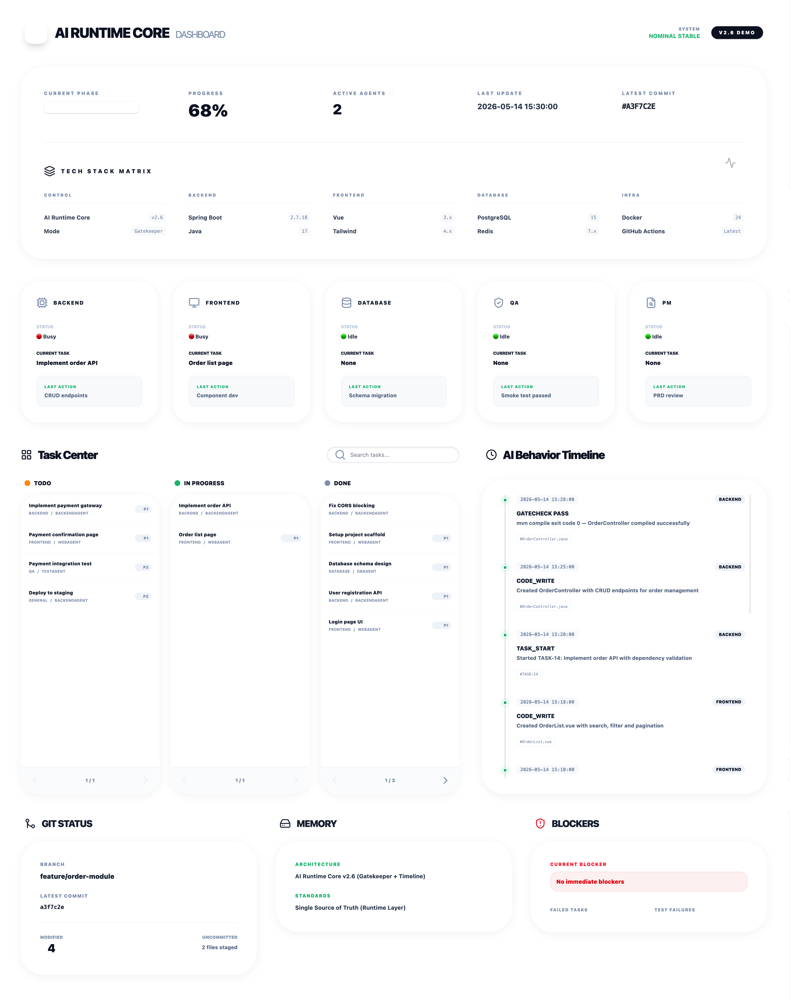

# S-AI-Guard

**S**olo **AI** **Guard** — A mechanical gatekeeper for single-agent development workflows.

[](https://opensource.org/licenses/MIT)
[](https://nodejs.org/)
[](CONTRIBUTING.md)

**English** | [中文文档](#中文文档)

---

A lightweight, config-driven task management engine for single-AI development. Enforces engineering discipline through mechanical verification, not LLM self-reporting.

## Dashboard Preview



## Why This Exists

When using AI (Claude, GPT, Gemini, etc.) to build software, the AI often:
- Claims it's "done" when the code doesn't even compile
- Skips steps and jumps ahead
- Loses context between sessions
- Introduces bugs it doesn't catch

S-AI-Guard solves this by putting a **mechanical gatekeeper** between the AI and the "done" state. The AI cannot mark a task complete until a real build command passes with exit code 0.

## What It Does

- **Task lifecycle** — `todo → doing → done` with enforced state transitions
- **Mechanical gatecheck** — `sai finish` runs real build/compile commands, checks exit codes
- **Dependency locking** — tasks cannot start until dependencies complete
- **Output verification** — confirms build artifacts exist (`dist/`, `target/`) after gatecheck
- **Session continuity** — `sai resume` recovers context after AI context window resets
- **Passive audit** — `sai check` detects zombie tasks, agent state mismatches, missing deps
- **Log rotation** — events auto-archived on task completion to prevent context bloat
- **Dashboard sync** — generates monitoring data for the web dashboard

## Quick Start

```bash
# 1. Copy into your project
cp -r runtime/ /your-project/runtime/
cp -r .agents/ /your-project/.agents/

# 2. Init
cd /your-project
node runtime/sai.js init

# 3. Edit config.json for your project
#    Set project name, agent paths, build commands, etc.

# 4. Add tasks to runtime/tasks.json
#    Each task: { id, type, title, description, status, priority, assignedAgent, dependsOn? }

# 5. Work through tasks
node runtime/sai.js start 1    # Begin task
# ... AI does the work ...
node runtime/sai.js finish 1   # Gatecheck + mark done
```

## Commands

| Command | Description |
|---------|-------------|
| `sai init` | Initialize project (create config + empty state files) |
| `sai status` | Show progress, active tasks, todo queue |
| `sai start <id>` | Begin a task (checks dependencies, creates plan) |
| `sai finish <id>` | Run gatecheck + mark done (fails if build fails) |
| `sai fail <id> <reason>` | Mark task as failed with reason |
| `sai fix <id> <plan>` | Restart a failed task with fix plan |
| `sai resume` | Show context for current doing task (session recovery) |
| `sai check` | Audit runtime health (zombies, sync, deps) |
| `sai log <role> <action> <target> <details>` | Append event to timeline |
| `sai sync-dashboard` | Generate dashboard data file |
| `sai learn <id>` | Extract knowledge from archived task log |

## Config Structure

All project-specific settings live in `runtime/config.json`:

```json
{
  "project": { "name": "My Project", "phase": "M1" },
  "paths": {
    "agents": {
      "backend": "backend/output",
      "web": "frontend/output"
    }
  },
  "agents": {
    "backendagent": { "type": "backend", "label": "Backend" },
    "webagent": { "type": "web", "label": "Frontend" }
  },
  "checkStrategies": {
    "backend": { "cmd": "mvn compile", "cwd": "agents.backend", "outputDir": "target" },
    "web": { "cmd": "npm run build", "cwd": "agents.web", "outputDir": "dist" }
  },
  "validFlow": {
    "todo": ["doing"],
    "doing": ["review", "testing", "done"],
    "review": ["doing", "done"],
    "done": []
  },
  "zombieThresholdHours": 24
}
```

## AI Workspace Rules

Place `.agents/rules/saiguard.md` and `.agents/workflows/saiguard.md` in your project root. These enforce:

- Must `sai start` before code changes
- Must `sai finish` after (no claiming "done" without gatecheck)
- Single task at a time
- No manual JSON editing
- Auto `sai status` on session start
- Config-driven: never hardcode project-specific values in sai.js

## Architecture

```
┌─────────────┐     ┌──────────┐     ┌───────────────┐     ┌───────────┐
│  Workspace  │────>│  S-AI-   │────>│  Mechanical   │────>│   Agent   │
│    Rules    │     │  Guard   │     │  Gatekeeper   │     │  (AI/LLM) │
│  (12 rules) │     │ (sai.js) │     │ (exit codes)  │     │           │
└─────────────┘     └──────────┘     └───────────────┘     └───────────┘
```

Single source of truth: `runtime/` directory. All state flows through sai.js commands.

## Directory Structure

```
your-project/
├── .agents/
│   ├── rules/saiguard.md            # 12 hard constraints
│   └── workflows/saiguard.md        # Auto-triggers
├── runtime/
│   ├── sai.js                       # Core engine
│   ├── config.json                  # Your project config (gitignored)
│   ├── config.template.json         # Template for init
│   ├── tasks.json                   # Task list
│   ├── project.json                 # Agent states
│   ├── events.json                  # Event timeline
│   ├── summary.json                 # Phase tracking
│   ├── failures.json                # Failure log
│   └── plans/                       # Task implementation plans
├── dashboard/
│   ├── index.html                   # Monitoring dashboard
│   └── data.js                      # Auto-generated by sync-dashboard
└── _archive/logs/                   # Archived task event logs
```

## AI Compatibility

Works with any AI that can:
1. Read and write files
2. Execute shell commands
3. Follow structured instructions

Tested with: Antigravity (Gemini), Claude Code, Cursor. If you use it with other AI tools, open an issue to let us know!

## Requirements

- Node.js >= 14
- Your project's build tools (mvn, npm, pytest, etc.)

## Contributing

See [CONTRIBUTING.md](CONTRIBUTING.md) for guidelines. Bug reports, feature requests, and pull requests are all welcome.

## License

[MIT](LICENSE) © 2026 HeLiu

---

<a id="中文文档"></a>

# 中文文档

**S**olo **AI** **Guard** — 单 AI 开发工作流的机械门禁引擎。

[](https://opensource.org/licenses/MIT)
[](https://nodejs.org/)
[](CONTRIBUTING.md)

一个轻量级、配置驱动的任务管理引擎，专为单 AI 开发工作流设计。通过机械验证而非 LLM 自我声明来执行工程纪律。

## 为什么需要这个

用 AI（Claude、GPT、Gemini 等）开发软件时，AI 经常：
- 代码连编译都不通过就说"完成了"
- 跳步骤、随意变更范围
- 会话之间丢失上下文
- 引入 BUG 却不自知

S-AI-Guard 的解决方案：在 AI 和"完成"状态之间放置一个**机械门禁**。AI 无法将任务标记为完成，直到真实的构建命令以 exit code 0 通过。

## 核心功能

- **任务生命周期** — `todo → doing → done`，强制状态流转
- **机械门禁** — `sai finish` 执行真实编译/构建命令，检查 exit code
- **依赖锁定** — 前置任务未完成，后续任务无法启动
- **产物校验** — 构建通过后检查 `dist/`、`target/` 目录是否生成且非空
- **断点续接** — `sai resume` 恢复 AI 上下文窗口重置后的任务上下文
- **被动审计** — `sai check` 检测僵尸任务、agent 状态不一致、依赖缺失
- **日志滚动** — 任务完成时自动归档事件日志，防止上下文膨胀
- **看板同步** — 生成监控面板数据

## 快速开始

```bash
# 1. 复制到你的项目
cp -r runtime/ /your-project/runtime/
cp -r .agents/ /your-project/.agents/

# 2. 初始化
cd /your-project
node runtime/sai.js init

# 3. 编辑 config.json
#    设置项目名、agent 路径、构建命令等

# 4. 在 runtime/tasks.json 中添加任务
#    格式: { id, type, title, description, status, priority, assignedAgent, dependsOn? }

# 5. 开始工作
node runtime/sai.js start 1    # 启动任务
# ... AI 执行工作 ...
node runtime/sai.js finish 1   # 门禁验证 + 标记完成
```

## 命令一览

| 命令 | 说明 |
|------|------|
| `sai init` | 初始化项目（从模板创建 config + 空状态文件） |
| `sai status` | 显示进度、活跃任务、待办队列 |
| `sai start <id>` | 启动任务（检查依赖、创建实施计划） |
| `sai finish <id>` | 运行门禁验证 + 标记完成（构建失败则无法完成） |
| `sai fail <id> <reason>` | 标记任务失败并记录原因 |
| `sai fix <id> <plan>` | 以修复计划重启失败任务 |
| `sai resume` | 显示当前进行中任务的完整上下文（会话恢复） |
| `sai check` | 审计运行时健康状态（僵尸任务、状态同步、依赖） |
| `sai log <role> <action> <target> <details>` | 追加事件到时间线 |
| `sai sync-dashboard` | 生成监控面板数据文件 |
| `sai learn <id>` | 从归档日志中提取知识 |

## 架构

```
┌─────────────┐     ┌──────────┐     ┌───────────────┐     ┌───────────┐
│  工作空间    │────>│ S-AI-    │────>│   机械门禁     │────>│   Agent   │
│  规则层      │     │ Guard    │     │  (exit codes) │     │  (AI/LLM) │
│  (12 条规则) │     │ (sai.js) │     │               │     │           │
└─────────────┘     └──────────┘     └───────────────┘     └───────────┘
```

单一数据源：`runtime/` 目录。所有状态流转通过 sai.js 命令驱动。

## AI 兼容性

适用于任何能够执行以下操作的 AI：
1. 读写文件
2. 执行 shell 命令
3. 遵循结构化指令

已在以下平台验证：Antigravity (Gemini)、Claude Code、Cursor。如果你在其他 AI 工具上使用，欢迎提 issue 告诉我们！

## 贡献指南

欢迎提交 Bug 报告、功能建议和 Pull Request。详见 [CONTRIBUTING.md](CONTRIBUTING.md)。

## 许可证

[MIT](LICENSE) © 2026 HeLiu
